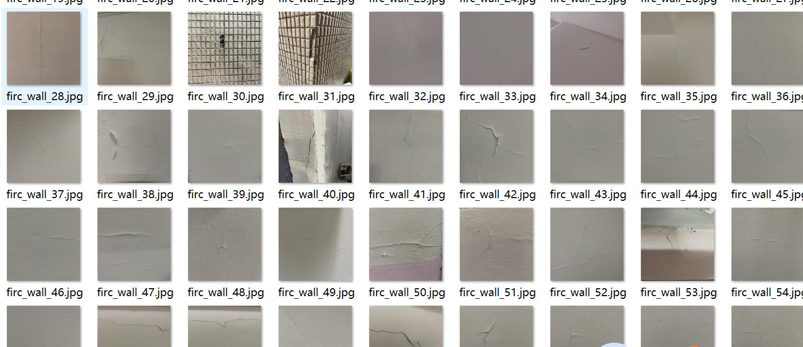
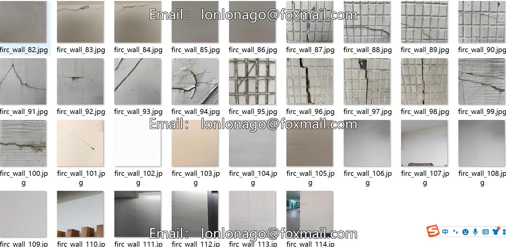
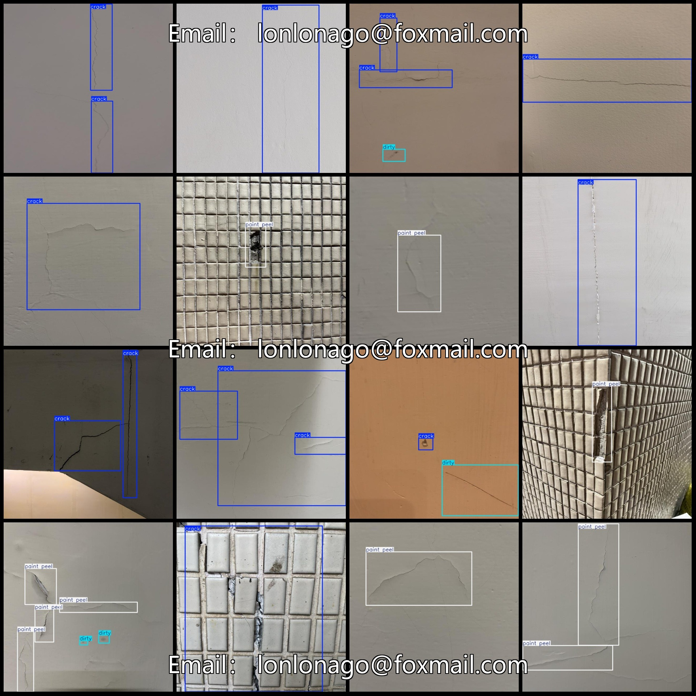
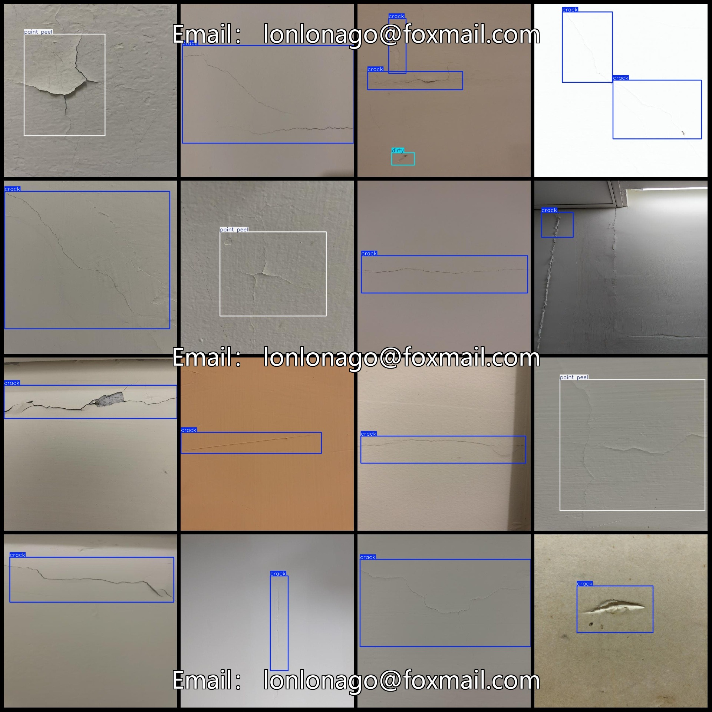

# Wall Surface Cracks and Dirtyness/Delamination Detection Dataset in VOC+YOLO format with 114 images across 3 classes

Dataset format: Pascal VOC format + YOLO format (txt files without split paths, only containing jpg images and corresponding VOC format xml files and yolo format txt files)
Number of images (jpg file count): 114
Number of annotations (xml file count): 114
Number of annotations (txt file count): 114
Number of annotation categories: 3
Annotation category names (note that the order in yolo format is not consistent with this, but refer to the labels folder classes.txt): ["crack", "dirty", "paint peel"]
Each category has an annotation box count:
- Crack (cracks) annotation boxes = 113
- Dirty (dirt) annotation boxes = 18
- Pain peel (peeling) annotation boxes = 46
Total number of annotation boxes: 177
Image resolution: 640x640
Using labeling tool: labelImg
Annotation rules: drawing rectangle boxes for each category
Important note: There are no specific instructions provided at this time.
Special Statement: This dataset does not guarantee the accuracy of the trained model or weight files.
Image preview:
## Images

Here is a pay link on Stripe ( https://buy.stripe.com/3cs8yP7sY87d0vu9AB ). Please contact me lonlonago@foxmail.com after funding $89, and I will send you a complete data files , thank you!

